# B.Tech-Subjects

This repository serves as a centralized **storage unit for all B.Tech subjects spanning from Semester 1 to Semester 8**. It is a comprehensive collection of academic materials, assignments, laboratory exercises, and code examples for the entire Bachelor of Technology (B.Tech) curriculum. Designed to be a complete knowledge base for students throughout their 4-year degree program, it offers resources ranging from lecture notes and question banks to practical programming implementations and project files.

## Table of Contents

1.  [Title & Summary](#1-title--summary)
2.  [Features/Contents](#2-featurescontents)
3.  [Tech Stack](#3-tech-stack)
4.  [Visuals (Mermaid)](#4-visuals-mermaid)
5.  [Getting Started](#5-getting-started)

---

### 1. Title & Summary

This repository, **`B.Tech-Subjects`**, is a structured storage unit and compilation of educational resources covering every subject across all 8 semesters of the B.Tech engineering curriculum. It encompasses lecture notes, detailed syllabi, assignment problem sets, question banks for examinations, and practical coding examples from various courses. The goal is to provide a readily accessible and organized archive of learning materials to support students from their first day of Semester 1 through to their final Semester 8 exams.

### 2. Features/Contents

The repository is organized by subject, with each directory containing relevant files. Key types of content include:

*   **Study Materials**:
    *   Lecture notes, presentations (`.pdf`, `.pptx`)
    *   Detailed syllabi (`.pdf`, `.docx`)
    *   Textbooks and reference guides (`.pdf`)
    *   Unit-wise important questions and answer keys (`.pdf`, `.docx`)
    *   Minor and semester exam question papers/banks (`.pdf`, `.docx`, `.jpg`)
*   **Assignments & Lab Exercises**:
    *   Assignment descriptions and problem statements (`.pdf`, `.docx`)
    *   Lab manuals and experiment outlines (`.pdf`, `.docx`)
    *   Sample outputs and solutions for practical exercises (`.pdf`, `.docx`)
*   **Code Examples & Projects**:
    *   **Java**: Implementations for Advanced Data Structures, Professional Development Skills (basic coding, patterns, maths, strings, exceptions), Campus Recruitment Training (various programming tasks), Cryptography and Network Security (ciphers like DES, AES, RSA, Blowfish, MD5, SHA), and Mobile Application Development (Android projects).
    *   **Python**: Scripts and Jupyter Notebooks for Python Programming fundamentals, Data Analytics (Pandas, NumPy, Matplotlib, Seaborn), Recommendation Systems, and Artificial Intelligence & Machine Learning (KNN, SVM, Decision Trees, Clustering, PCA).
    *   **Web Technologies (MERN Stack)**: HTML, CSS, and JavaScript files for front-end development basics, along with conceptual notes for Node.js, React.js, and MongoDB.
    *   **Salesforce Development**: Apex classes, Lightning Web Components (`.js`, `.html`, `.css`, `.xml`), and Salesforce DX project configurations.
    *   **Big Data Technologies**: Configuration files and Java examples for Hadoop (HDFS, MapReduce, Spark, NoSQL).
*   **Data Files**: Sample datasets (`.csv`, `.xlsx`) for analytics, machine learning, and big data exercises.
*   **Setup Guides**: Instructions for setting up development environments (e.g., Hadoop on Windows/Ubuntu).

**Subject Categories Covered:**

*   Big Data Analytics
*   Cloud Computing
*   Computer Organization and Architecture
*   Professional Development Skills (I & II)
*   Python Programming
*   Human Values and Professional Ethics
*   Salesforce Platform Development
*   Discrete Mathematics
*   Mathematics-1
*   Advanced Data Structures
*   Human Resource Management
*   Computer Aided Engineering Graphics
*   Database Management System
*   Campus Recruitment Training
*   Financial Institutions Markets and Services
*   Distributed Operating Systems
*   Recommendation Systems
*   Differential and Integral Calculus
*   Career Advancement Skills
*   Basic Electrical and Electronics Engineering
*   Mulesoft Anypoint Platform
*   Startup Innovation and Entrepreneurship
*   Cryptography and Network Security
*   Applied Physics
*   Agile Software Development
*   Compiler Design
*   Probability and Statistics
*   Data Structures
*   Mobile Application Development
*   Artificial Intelligence & Machine Learning
*   Java Programming
*   Deep Learning and its Applications
*   Data Analytics
*   MERN Stack Web Development
*   Environmental Sciences
*   Internet of Things
*   English / English for Technical Communication and Employability Skills
*   Software Quality Testing
*   French
*   Data Mining
*   Computer Networks
*   Operating Systems
*   Design and Analysis of Algorithms
*   India Heritage and Economy
*   Object Oriented Software Engineering

### 3. Tech Stack

This repository showcases a diverse range of technologies and tools:

*   **Programming Languages**:
    *   Java
    *   Python
    *   JavaScript (ES6+)
    *   HTML5, CSS3
    *   Apex (Salesforce)
    *   C (implied in some Computer Organization or Data Structures contexts, though no explicit `.c` files found in the provided sample, but common for B.Tech)
*   **Frameworks & Libraries**:
    *   Apache Hadoop (HDFS, MapReduce)
    *   Apache Spark
    *   AWS, Azure (Cloud Computing services)
    *   Salesforce Platform (Lightning Web Components, Salesforce DX)
    *   Android SDK
    *   Node.js, React.js (MERN Stack)
    *   MongoDB
    *   Pandas, NumPy, Matplotlib, Seaborn (Python for Data Analytics)
    *   Jupyter Notebook
    *   Various cryptography libraries (Java Cryptography Architecture for CNS)
*   **Tools & Concepts**:
    *   Git & GitHub
    *   Linux/Ubuntu CLI
    *   SSH
    *   Integrated Development Environments (IDEs) like IntelliJ IDEA, Eclipse, VS Code, Android Studio (implied)
    *   AutoCAD (Computer Aided Engineering Graphics)
    *   Data structures and algorithms concepts

### 4. Visuals (Mermaid)

The following flowchart illustrates the high-level structure and content flow within the `B.Tech-Subjects` repository:

```mermaid
graph TD
    A[B.Tech-Subjects Repository] --> B{Subject Categories};
    B --> BDA[Big Data Analytics];
    B --> CC[Cloud Computing];
    B --> PDS2[Professional Development Skills-2];
    B --> PP[Python Programming];
    B --> SPD[Salesforce Platform Development];
    B --> ADS[Advanced Data Structures];
    B --> CNS[Cryptography & Network Security];
    B --> MAD[Mobile Application Development];
    B --> DA[Data Analytics];
    B --> MERN[MERN Stack Web Development];
    B --> OtherSubjects[...Other B.Tech Subjects];

    BDA --> BDA_Notes(Notes/PPTS .pdf .pptx);
    BDA --> BDA_Labs(Hadoop/Spark Setup .txt);
    BDA --> BDA_Code(MapReduce Java .java);
    BDA --> BDA_Data(Sample Data .csv);

    CC --> CC_Notes(Theory/PPTs .pdf .pptx);
    CC --> CC_Labs(AWS/Azure Experiments .pdf .docx);
    CC --> CC_Conf(Config/Passwords .txt);

    PDS2 --> PDS2_Lectures(Lectures .pdf .docx);
    PDS2 --> PDS2_Code(Java Programs .java);
    PDS2 --> PDS2_Assignments(Assessments .pdf);

    PP --> PP_Notes(Python Intro/OOP .pptx .pdf);
    PP --> PP_Code(Practice Programs .py);
    PP --> PP_Labs(Jupyter Notebooks .pdf);

    SPD --> SPD_Theory(Units/Concepts .pdf);
    SPD --> SPD_Code(Apex, LWC .java .js .html .css);
    SPD --> SPD_Projects(SFDX Projects .xml);
    SPD --> SPD_Data(Import Data .csv);

    ADS --> ADS_Theory(Unit Notes .pdf);
    ADS --> ADS_Code(Java DS Implementations .java .zip);
    ADS --> ADS_Labs(Workshop Problems .java);

    CNS --> CNS_Theory(Crypto Concepts .pdf .pptx);
    CNS --> CNS_Code(Cipher Implementations .java);
    CNS --> CNS_Assignments(Lab Outputs .pdf .docx);

    MAD --> MAD_Theory(Android Components .pptx .pdf);
    MAD --> MAD_Code(Android Projects .java .xml);
    MAD --> MAD_Labs(Lab Manuals .docx .pdf);

    DA --> DA_Theory(DA Concepts .pdf .pptx);
    DA --> DA_Code(Python for DA .py .ipynb);
    DA --> DA_Data(Datasets .csv .xlsx);

    MERN --> MERN_Basics(HTML/CSS/JS Notes .pdf);
    MERN --> MERN_Code(Web Examples .html .css .js);
    MERN --> MERN_Concepts(Node/React/Mongo .pdf .docx);

    OtherSubjects --> GeneralMaterials(Notes, Q&A, Assignments .pdf .docx);
```



### 5. Getting Started

To access and utilize the contents of this repository, follow these general steps:

1.  **Clone the Repository:**
    ```bash
    git clone https://github.com/YOUR_USERNAME/B.Tech-Subjects.git
    cd B.Tech-Subjects
    ```

2.  **Accessing Documents:**
    Most lecture notes, assignments, and question banks are in `.pdf`, `.pptx`, or `.docx` formats. You can open these directly with any compatible viewer (e.g., Adobe Acrobat Reader, Microsoft PowerPoint, Microsoft Word, or their open-source alternatives).

3.  **Running Code Examples:**

    *   **Java Programs**:
        *   **Prerequisites**: Java Development Kit (JDK) 8 or higher. An IDE like IntelliJ IDEA or Eclipse is recommended.
        *   **Compile**: Navigate to the directory containing the `.java` file (e.g., `B.Tech-Subjects/Professional Development Skills-2/`) and compile:
            ```bash
            javac YourProgram.java
            ```
        *   **Run**:
            ```bash
            java YourProgram
            ```
        *   For projects with multiple files or external libraries (e.g., in `Advanced Data Structures`), you might need to use a build tool like Maven or Gradle, or manually include JARs in the classpath. Refer to specific subject folders for more context.

    *   **Python Scripts and Jupyter Notebooks**:
        *   **Prerequisites**: Python 3.x installed. For notebooks and data analysis, install `pip` and then packages like `pandas`, `numpy`, `matplotlib`, `seaborn`, `jupyter`:
            ```bash
            pip install pandas numpy matplotlib seaborn jupyter
            ```
        *   **Run a Python script (`.py`)**:
            ```bash
            python your_script.py
            ```
        *   **Run a Jupyter Notebook (`.ipynb`)**:
            ```bash
            jupyter notebook
            # This will open in your browser. Navigate to the .ipynb file and open it.
            ```

    *   **Web Development (HTML/CSS/JavaScript)**:
        *   Open `.html` files directly in your web browser. For JavaScript files that rely on Node.js, navigate to the respective project directory and follow its `package.json` instructions (e.g., `npm install`, `npm start`).

    *   **Salesforce Platform Development**:
        *   **Prerequisites**: Salesforce CLI, Visual Studio Code with Salesforce Extensions, and access to a Salesforce Developer Org or Scratch Org.
        *   Refer to the specific project's `README.md` (e.g., `B.Tech-Subjects/Salesforce Platform Development/Event Management/README.md`) for detailed deployment and execution steps.

    *   **Android (Mobile Application Development)**:
        *   **Prerequisites**: Android Studio.
        *   Open the project folder (e.g., `B.Tech-Subjects/Mobile Application Development/project1/`) in Android Studio. The IDE will handle dependency resolution (Gradle). You can then run the application on an emulator or a physical device.

    *   **Hadoop / Spark (Big Data Analytics)**:
        *   **Prerequisites**: A Linux environment (e.g., Ubuntu, preferably in a VM or WSL) with Java 8 installed.
        *   Refer to the `Hadoop_Setup_Guide.txt` located in `B.Tech-Subjects/Big Data Analytics/` for detailed step-by-step instructions on setting up a single-node Hadoop cluster. This guide includes commands for user setup, SSH configuration, Hadoop download/extraction, environment variables, and configuration files (`core-site.xml`, `hdfs-site.xml`). Java MapReduce programs will typically be run from the Hadoop installation.

---

Feel free to explore the directories and files relevant to your current studies.
